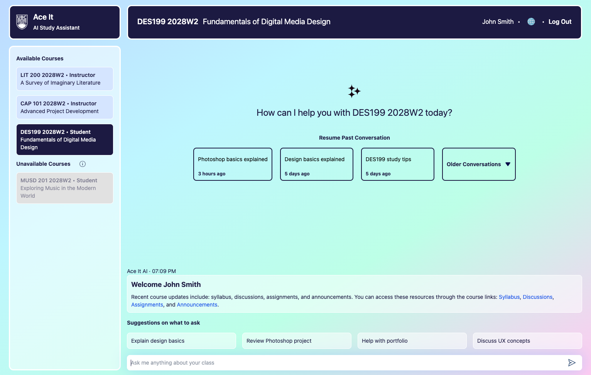
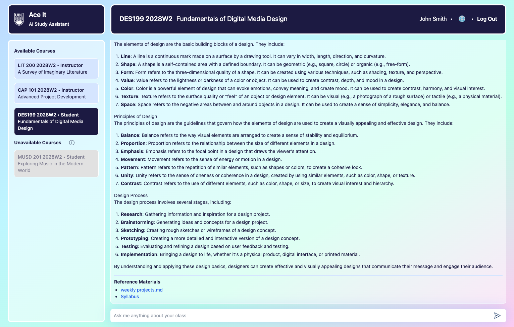
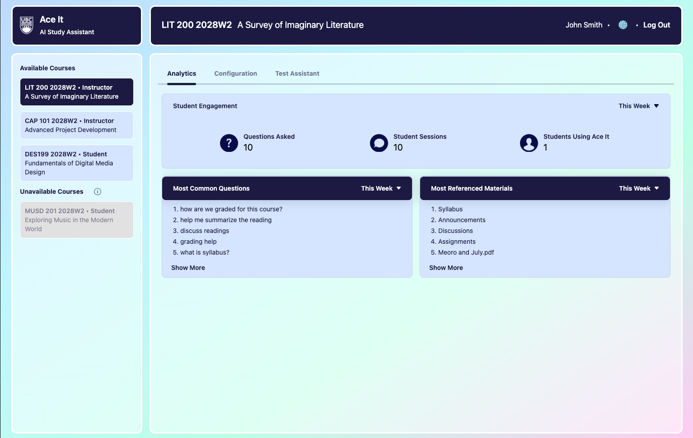
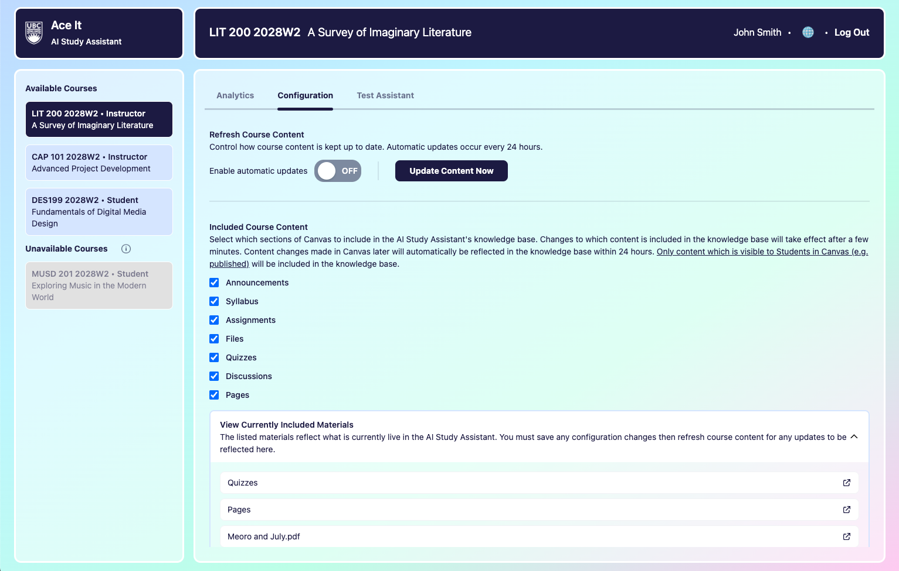
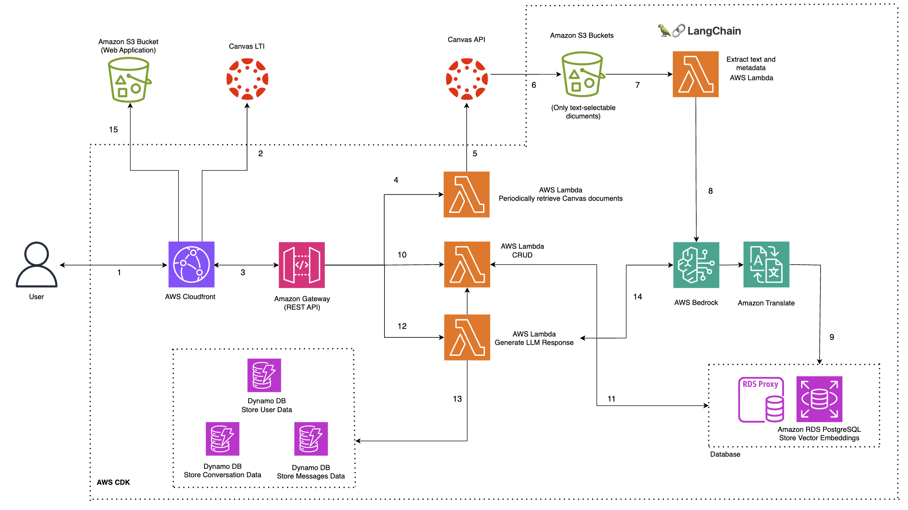

# Ace It - AI Study Assistant

## Project Overview

Ace It is an AI Study Assistant designed to help university students with their courses. Integrated directly with Canvas LMS and leveraging AI large language models (LLM), Ace It is able to access course information to provide Students contextual support in areas such as:

- Finding Course Information & Material References
- Providing Learning Recommendations (Tips & Suggested Materials)
- Solution Review & Feedback
- Problem Explanation

This repository contains the complete code for the project, including the frontend, backend, and AWS infrastructure.

### Demo

Note that the quality of the demo video is lower than actual due to gif compression.


### User Experience & Features

Users may have one of two roles for each course they are associated with in Canvas, either "Student" or "Instructor". Users are not assigned roles for courses in Ace It, the solution instead uses the roles specified in Canvas.

All users are able to:

1. Log-in using their Canvas authentication credentials
2. See all of their courses in Canvas, separated between "Available Courses" (where the user is an Instructor or the Instructor has enabled Student access) and "Unavailable Courses" (where the Instructor has not enabled Student Access)
3. Change their preferred language for Ace It (both AI responses and user interface)

With the Student role, users are able to:

1. Start new conversation sessions or continue previous ones with the AI Study Assistant
2. Ask questions to the AI Study Assistant in their preferred language
3. Receive responses from the AI Study Assistant in their preferred language with references to Canvas

With the Instructor role, users are able to:

1. View Ace It usage analytics for the course
   - Number of questions asked
   - Number of student sessions
   - Number of students using Ace It
   - Most common questions (determined using AI)
   - Most referenced materials
2. Configure the AI Study Assistant for the course, specifically:
   - Enable Student access to the course (default no access)
   - Select which course content to include from Canvas (e.g. Announcements, Syllabus, Files, etc.)
   - Select which types of questions should be supported by the AI Study Assistant
   - Configure custom response tone / style
3. Test the AI Study Assistant for the course, sending messages like a Student would to evaluate the experience

The solution also features:

1. Easy configurable theming and branding.
2. Serverless AWS cloud deployment.
3. Model agnostic LLM support.

### Screenshots

|                                         |                                         |
| :-------------------------------------: | :-------------------------------------: |
|  |  |
|  |  |

---

## Technical Details

### Key Technologies

Ace It leverages the following key technologies:

- Frontend: React.js (Vite)
- Backend: Python 3
- Infrastructure: AWS CDK

### Infrastructure Architecture

Built with a Serverless architecture, Ace It is designed to be highly scalable and performant. The following diagram depicts the high-level AWS architecture:



---
1. The user communicates with the web application hosted on AWS Cloudfront.
2. Redirects to Canvas LTI for authentication, returns an authorization token when access is granted.
3. The frontend app communicates with Amazon API Gateway for backend interactions.
4. A Lambda function will periodically be triggered to retrieve course documents from Canvas API.
5. To retrieve documents from Canvas API, use the token passed from Amazon API Gateway.
6. The retrieved documents are stored in Amazon S3, which initiates a data ingestion workflow.
7. A lambda function, integrated with LangChain, extracts text and metadata (size, date uploaded) from the stored documents in S3.
8. The extracted data is embedded using Amazon Bedrock, specifically leveraging the Amazon Titan Text Embeddings v2 model to generate vector embeddings.
9. These vector embeddings are stored in a PostgreSQL database. If users have a preferred language, it will be translated using Amazon Translate.
10. Course management/assistant access can be configured by sending an API request which invokes a lambda function. The course configuration settings are restricted to instructors of that course.
11. This lambda function interacts with Amazon RDS database.
12. This lambda function generates an LLM response when students chat with the assistant and sends a query.
13. Conversations and chat data are stored in Amazon RDS PostgreSQL.
14. The assistant employs a Retrieval-Augmented Generation (RAG) architecture, combining with relevant course specific data to generate a response from the LLM.
15. CloudFront fetches the frontend files from S3 bucket, and Serves cached frontend content globally.

### Repository Structure

The repository is organized into the following main directories:

- `.vscode/`: Contains Visual Studio Code configuration files.
- `AceIT-ECE-Capstone/`: Root directory for the project.
  - `.github/`: GitHub configuration files and workflows.
    - `workflows/`: Contains GitHub Actions workflows for CI/CD.
  - `docs/`: Documentation files.
  - `frontend/`: Frontend codebase.
    - `public/`: Public assets for the frontend.
    - `src/`: Source code for the frontend.
      - `assets/`: Static assets like images, fonts, etc.
      - `components/`: Reusable React components.
      - `hooks/`: Custom React hooks.
      - `pages/`: Page components for different routes.
      - `services/`: API service calls.
      - `styles/`: CSS and styling files.
      - `utils/`: Utility functions and helpers.
  - `lambda/`: AWS Lambda functions.
  - `layers/`: AWS Lambda layers.
  - `priv_ace_it_ece_capstone_main/`: Private directory for main project files.
  - `tests/`: Unit and integration tests for the project.
- `app.py`: Entry point for the backend application.
- `cdk.context.json`: AWS CDK context configuration.
- `cdk.json`: AWS CDK project configuration.
- `makefile`: Makefile for build automation.
- `README.md`: Project documentation.
- `requirements-dev.txt`: Development dependencies for the backend.
- `requirements.txt`: Production dependencies for the backend.
- `source.bat`: Batch script for setting up the environment.

---

## Deploying & Running Ace It on AWS

### Pre-Requisites

To deploy Ace It, you will need to first have the following pre-requisites:

1. A Canvas LMS instance where you have the Admin role
   - If you need to first set up a Canvas instance, please refer to the [Canvas documentation here](https://github.com/instructure/canvas-lms/wiki/Production-Start)
2. An AWS account with appropriate permissions for deployment

### Instructions

Deploying Ace It on your AWS account requires minor configuration in several areas across infrastructure, Canvas LMS, backend, and frontend.

#### Canvas LMS Configuration

To integrate this project with **Canvas LMS**, follow these steps:

##### 1. AceIt Canvas Account creation
- It is recommended to create a Canvas Admin Account for AceIt integration use only.
1. Log in to your **Canvas LMS** instance as an **Admin**.
2. Navigate through **Admin** > **Site Admin** > **Settings** > **Admins**
3. Click **+ Account Admins**
4. Fill in your account info. 
5. Confirm the account details and Click **Continue** > **OK**

##### 2. Access Token generation
An access token is required to retrieve course content from Canvas.

1. Log in to your **AceIt** Canvas Admin Account
2. Navigate to **Account** > **Settings**.
3. Scroll down to the **Approved Integrations** section.
4. Click **+ New Access Token**.
5. Enter a purpose (e.g., "AceIt Integration") and click **Generate Token**.
6. Copy the generated token and store it securely (this token will not be shown again).

##### 3. Developer Key Generation
To allow authentication with the Canvas account, create a **Developer Key**.

1. Navigate to **Admin** > **Developer Keys**.
2. Click **+ Developer Key** > **API Key**.
3. Fill in the required details:
   - **Key Name**: (e.g., "AceIt Key")
   - **Redirect URIs**: The CloudFront Distribution domain name set up in AWS Configuration steps.
   - **Scopes**: Select appropriate API permissions for accessing course data. (Disable scope to allow access to all endpoints)
4. Click **Save Key** and toggle it **ON**.
5. Copy the **Client ID** and **Client Secret**.

#### AWS Configuration

To deploy Ace It on AWS, you'll need an AWS account with the appropriate permissions. This section covers two deployment methods:

- Method 1: Using GitHub Actions for CI/CD deployment.
- Method 2: Manual deployment without using GitHub Actions.

##### Pre-Requisites

- AWS Account: Ensure you have an AWS account with administrative access.
- AWS Bedrock Request Access to: (In AWS Console > AWS Bedrock)
  - Llama 3.3
  - Amazon Text Embeddings Titan v2
- Clone this Github repository.

##### Method I. Using Github Action [Recommended]

1. Create an IAM role that GitHub Actions can assume to deploy resources on AWS.
   1.1 Go to AWS Console > IAM > Create role, make sure you are in the desired region.
   1.2 Under Select trusted entity, choose Web identity > Add Identity provider
   1.3 Select OpenID Connect, Provider URL will be `token.actions.githubusercontent.com`, click Add Provider
   1.4 Add the Identity Provider you just created, set Audience to be `sts.amazon.aws.com`.
   1.5 Fill in the Github organization
   1.6 Add permissions. For simplicity, we will attach `AdministratorAccess` to allow GitHub Action to have full access to AWS services.
   1.7 Give this role a name, and create this role.
   1.8 Go to the Github repository > Settings > Secrets and Variables > Actions
   1.9 Create secrets for:
   - AWS_ROLE_ARN: The ARN of the IAM Role created.
   - AWS_REGION: Your preferred AWS region (e.g., us-west-2).
   - AWS_ACCOUNT_ID: Your AWS Account ID.
     1.10 Open the github workflows in .github/workflows/deploy.yml, replace the value of `role-to-assume` and `aws-region` to be `${{ secrets.AWS_ROLE_ARN }}` and `${{ secrets.AWS_REGION }}` respectively.
2. Create an S3 bucket to host the frontend files.
   2.1 Go to AWS Console > S3 > Create bucket > General Purpose, make sure you are in the desired region.
   2.2 Give a name to the bucket, this is for the front end, so uncheck `Block all public access`
   2.3 Bucket Policy:

```
{
  "Version": "2012-10-17",
  "Statement": [
      {
          "Sid": "PublicReadGetObject",
          "Effect": "Allow",
          "Principal": "*",
          "Action": "s3:GetObject",
          "Resource": "arn:aws:s3:::myfrontendbucket3/*"
      }
  ]
}
```

3. Set Up CloudFront
   3.1 Go to AWS Console > CloudFront > Create distribution, make sure you are in the desired region.
   3.2 Create Distribution:
   - Origin Domain Name: Select the S3 bucket created in step 2.
   - Viewer Protocol Policy: Redirect HTTP to HTTPS
   - Allowed HTTP Methods: GET, HEAD, OPTIONS, PUT, POST, PATCH, DELETE
   - Cache Policy: Managed-CachingOptimized
   - Origin Request Policy: CORS-S3Origin
   - Response headers policy name: Managed-CORS-With-Preflight
     3.3 After creating distribution, Copy the Distribution domain name. It'll be used for Access-Control-Allow-Origin.
4. Modify .github/workflows/deploy.yml:
   - replace `role-to-assume` to be `${{ secrets.AWS_ROLE_ARN }}`
     `aws-region`: `${{ secrets.AWS_REGION }}`

##### Method II. No Github Action

1. follow instructions on this <a href="https://docs.aws.amazon.com/cli/latest/userguide/cli-configure-files.html">AWS Documentation</a> to install AWS CLI and configure local AWS Credentials.
2. Create an S3 bucket to host the frontend files.
   2.1 Go to AWS Console > S3 > Create bucket > General Purpose, make sure you are in the desired region.
   2.2 Give a name to the bucket, this is for the front end, so uncheck `Block all public access`
   2.3 Upload the all files in frontend to the S3 bucket created.
   2.4 Bucket Policy:

```
{
  "Version": "2012-10-17",
  "Statement": [
      {
          "Sid": "PublicReadGetObject",
          "Effect": "Allow",
          "Principal": "*",
          "Action": "s3:GetObject",
          "Resource": "arn:aws:s3:::myfrontendbucket3/*"
      }
  ]
}
```

3. Set Up CloudFront, follow the steps in Method I step 3.

#### Backend Configuration

1. Due to security considerations, it is the best practice to manually create Canavs Secrets.
   1.1 Go to AWS Console > Secrets Manager > Store a new secret
   1.2 Select secret type = Other type of secret
   1.3 Under the Secret Value - Key/Value, enter:

| Secret key       | Secret value                                                              |
| ---------------- | ------------------------------------------------------------------------- |
| apiKey           | The API Developer Key obtained from Canvas                                |
| redirectURI      | The CloudFront Distribution domain name set up in AWS Configuration steps |
| baseURL          | The base URL of the Canvas server                                         |
| apiKeyId         | The API Developer Key Id displayed on Canvas                              |
| adminAccessToken | The Canvas Admin Access Token                                             |

2. Give this Secret a name. If the name is other than "
   CanvasSecrets", please also change the secret name in get_canvas_secret.py. Replace `secret_name` with the name of your secret (e.g. "CanvasSecrets")
3. Once the necessary secrets have been configured in AWS Secrets Manager, you can deploy the backend code. There are two methods for deployment:

- Method I. Using Github Action [Recommended]
  3.1.1 Create a new GitHub repository (if not already done):
  Go to GitHub → New Repository → Set the repository name (e.g., AceIT-ECE-Capstone).
  3.1.2 Commit and push your cloned repository to GitHub.
  3.1.3 Ensure that GitHub Secrets are properly set up in AWS Configuration step
  3.1.4 Trigger the GitHub Actions deployment - Push any changes to main to trigger the deployment workflow
  3.1.5 If successful, the backend Lambda functions and infrastructure should be deployed. You can check the deployed stack url in GitHub Repository > Actions > Select the latest deployment workflow.

- Method II. Manual Deployment Without GitHub Actions
  3.2.1 If you prefer not to use GitHub Actions, follow these steps to deploy the backend manually using AWS CDK.
  3.2.2 Install AWS CDK, python dependencies by running `npm install -g aws-cdk`, `pip install -r requirements.txt` and `pip install -r requirements-dev.txt`in terminal and make sure the working directory is at the root, i.e. ACEIT-ECE-CAPSTONE.
  3.2.3 Make sure you've completed steps in AWS Configuration Method II to set up your AWS Credentials
  3.2.4 Type in terminal `cdk bootstrap`, then type `cdk deploy --require-approval never`
  3.2.5 If successful, there will be a deployed stack url displayed in your terminal. these will be your backend function urls.

#### Frontend Configuration

There are two key types of frontend configuration. They are as follows:

1. Configure theme and branding in `frontend/theme.ts`
2. Configure API destinations in `frontend/.env`

Further details on what to configure in each of these files can be found within the files themselves.
